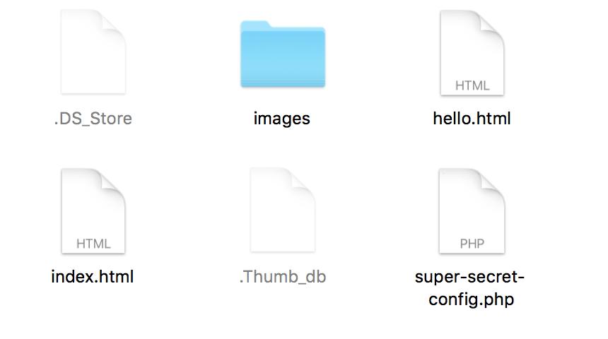

# Quiz
---
## 1. Getting setup with Git

`git remote add origin git@github.com:develop-me/drupal1.git`

The above command sets the github repository's origin to the local master file that you have created on your computer. After you have initialised to work with git on your system, you can then create a repository in your github account and allow others to contribute to the same project if you share the repository with them.

## 2. Committing Files

```bash
On branch master
Changes not staged for commit:
  (use "git add <file>..." to update what will be committed)
  (use "git restore <file>..." to discard changes in working directory)
	modified:   hello.html

Untracked files:
  (use "git add <file>..." to include in what will be committed)
	images/
	index.html
```
In order to commit the images folder and index.html, I would use the commands...

```bash
git add images/ index.html
git commit -m "Apple"
```

Then to save hello.html in the next commit...

```bash
git add hello.html
git commit -m "Banana"
```
Alternatively, I could use...

`git commit -am "Banana"`

## 3. Reading Git Messages: Oh Noes #1

```bash
To github.com:develop-me/git-simple.git
 ! [rejected]        master -> master (fetch first)
error: failed to push some refs to 'git@github.com:develop-me/git-simple.git'
hint: Updates were rejected because the remote contains work that you do
hint: not have locally. This is usually caused by another repository pushing
hint: to the same ref. You may want to first integrate the remote changes
hint: (e.g., 'git pull ...') before pushing again.
hint: See the 'Note about fast-forwards' in 'git push --help' for details.
```

The above message has been returned when trying to push a version to the repository.

The error message is telling us that we can't push to the repository because your version is older than the current version in the repository and therefor you would overwrite and lose work in the repo. You would need to pull the current repo first to merge with your local work before pushing and updating the repo.

## 4. Reading Git Messages: Oh Noes #2

```bash
remote: Enumerating objects: 38, done.
remote: Counting objects: 100% (38/38), done.
remote: Compressing objects: 100% (16/16), done.
remote: Total 53 (delta 26), reused 31 (delta 22), pack-reused 15
Unpacking objects: 100% (53/53), done.
From github.com:develop-me/git-simple
   6f630d7..7176d81  master            -> origin/master
 * [new branch]      addteampagetonews -> origin/addteampagetonews
   1760f80..bacdb99  projectname       -> origin/projectname
Updating 6f630d7..7176d81
error: Your local changes to the following files would be overwritten by merge:
	index.html
Please commit your changes or stash them before you merge.
Aborting
```

The above error message has returned from trying to run the merge command.

You have made changes to the local version of index.html, which would then be overwritten if terminal allowed you to run this command. You would need to commit all current changes to index.html before running the merge command again.

## 5. Reading Git Messages: Oh Noes #3

```bash
remote: Enumerating objects: 9, done.
remote: Counting objects: 100% (8/8), done.
remote: Compressing objects: 100% (2/2), done.
remote: Total 5 (delta 3), reused 5 (delta 3), pack-reused 0
Unpacking objects: 100% (5/5), done.
From github.com:develop-me/git-simple
   a657ab7..d6b1aa1  master     -> origin/master
Auto-merging index.html
CONFLICT (content): Merge conflict in index.html
Automatic merge failed; fix conflicts and then commit the result.
```

The above error message has come from trying to push your master to the origin/master.

You would need to determine which changes you would like to keep by fixing the conflicts between the two versions of index.html in the local master and repo master. 

## 6. Burn it all!

In order to 'throw away' all work since last commit, you would run the command...

`git reset HEAD~ --hard`

## 7. (Sort of) Burn it all!

in order to 'throw away' the last commit, but keep the files as they are at this point of you working on them, you would run the command...

`git reset HEAD~ --soft`

## 8. Ignore it all!



To tell git to ignore all files except hello.html, you would create a .gitignore file in the folder...

`code .gitignore`

and list the files that you would like git to ignore...

```bash
.DS_store
images/
index.html
.Thumb_db
super-secret-config.php
```

## 9. Describe the process

The steps to setting up a new piece of work in gitflow would be...

- Setting up a repo on github
- Creating a local file on your computer using `mkdir project`
- Running `git init` to initialise git watching that file
- Create a file in your local folder using `code index.html`
- Do some work in the file and cmd+s file
- Check the `git status`
- Add file with `git add index.html`
- Commit the file with a message `git commit -m "Creating index.html"
- Then push the folder with file in from local to github repo using 
    `git remote add origin git@github.com:develop-me/drupal1.git`

## 10. npm & gulp

In order to bring in some of our favourite workflow from a previous project, we should use a package manager, npm, to specify the packages that your project will be usuing.

- `npm init` will initialise npm in the terminal and create a package.json file, you should enter through the questionare.
- `npm install {module name}` will create a node_modules folder and download and install packages into it.
- Creating a gulpfile.js will allow us to define and pull in dependencies (plugins), declare variables from these plugins and write js functions to define tasks.
- `gulp minify-css` would then run the minify-css task that we have created.

